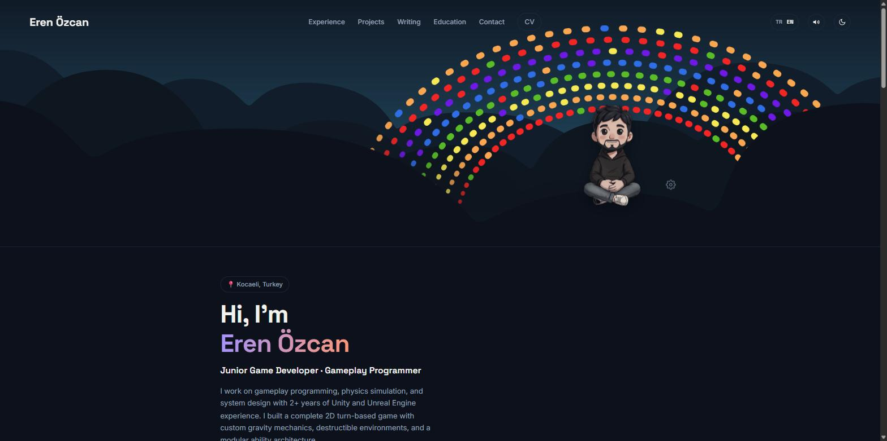

# Eren Özcan — Portfolio

[](https://erenozcan.dev)
[](https://pages.cloudflare.com/)
[](#)

Personal portfolio for **Eren Özcan** — Junior Game Developer & Gameplay Programmer (Unity, Unreal Engine, VR). Plain HTML/CSS/JS, no framework, no build step.

**🔗 erenozcan.dev**



## Features

- Bilingual (TR/EN) with instant client-side language toggle
- Light/dark theme toggle
- Interactive rainbow hero configurator (canvas, draggable, saved settings)
- Sections: Experience, Projects, Writing, Education, Contact
- No dependencies beyond Google Fonts — loads fast, no build pipeline

## Running locally

Just open `index.html` in a browser, or serve it:

```
npx serve .
```

## Deploy (Cloudflare Pages)

1. Cloudflare Dashboard → Workers & Pages → Create → Pages → Connect to Git
2. Select this repo
3. Build settings: **Framework preset: None**, **Build command:** empty, **Build output directory:** `/`
4. Every push to `main` triggers an automatic redeploy

Static assets are versioned via `?v=N` query strings on `style.css`/`script.js`, paired with `Cache-Control: no-cache, must-revalidate` in `_headers` — bump the version on every deploy that changes either file.

## Custom domain

Cloudflare Pages project → Custom domains → Set up a custom domain. If the domain is managed in Cloudflare, the DNS record is added automatically.
